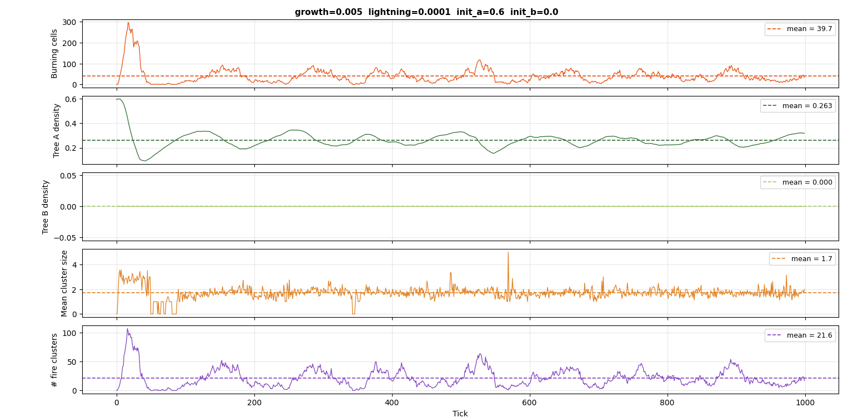
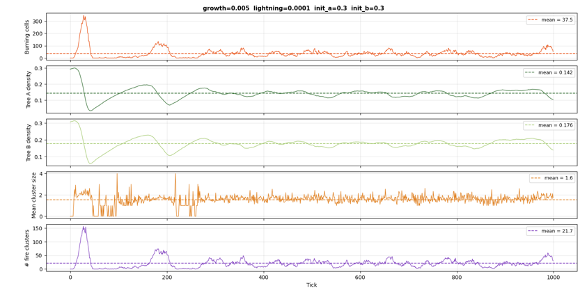
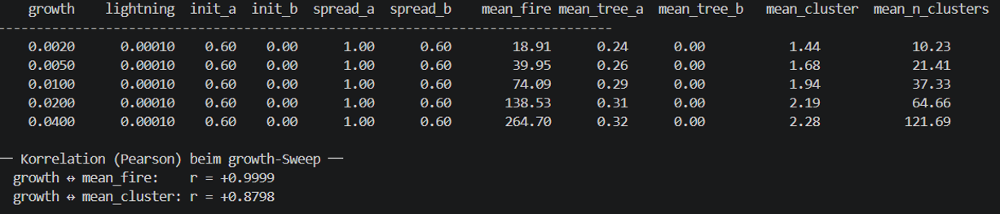
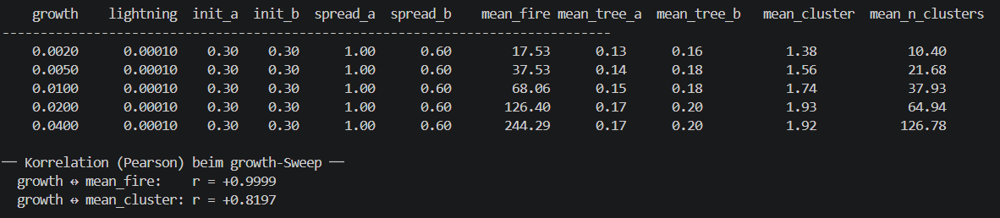
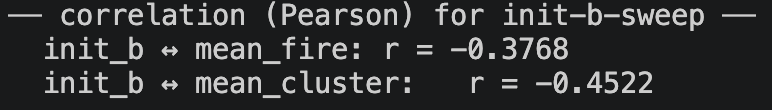

# Wildfire Simulation: Einfluss von Baumwachstum und Waldzusammensetzung auf Branddynamiken

## Abstract

In diesem Projekt wird ein vereinfachtes Waldbrandmodell als zellulärer Automat auf einem 100×100-Raster umgesetzt. Untersucht wird, wie sich unterschiedliche Baumwachstumswahrscheinlichkeiten und Waldzusammensetzungen auf die Branddynamik auswirken. Dafür wird ein reiner Nadelwald, bestehend aus dem leicht entzündlichen Baumtyp A, mit einem Mischwald aus Baumtyp A und dem feuerresistenteren Baumtyp B verglichen. Ausgewertet werden die mittlere Anzahl gleichzeitig brennender Zellen pro Tick, die mittlere Größe zusammenhängender Feuercluster und die mittlere Anzahl gleichzeitig aktiver Feuercluster. Die Ergebnisse zeigen, dass höheres Baumwachstum die Brandaktivität deutlich erhöht, während ein höherer Anteil feuerresistenter Bäume die Ausbreitung tendenziell abschwächt. Das Modell macht damit grundlegende Zusammenhänge zwischen Baumwachstum, Waldzusammensetzung und räumlicher Feuerausbreitung sichtbar, bleibt jedoch durch fehlende reale Faktoren wie Wind, Topografie und Feuchtigkeit stark vereinfacht.

## 1. Introduction

Waldbrände sind ein Beispiel für ein räumliches Ausbreitungsphänomen, bei dem lokale Prozesse zu großräumigen Mustern führen können. Ob ein Feuer klein bleibt oder sich über größere Bereiche ausbreitet, hängt unter anderem davon ab, wie viel brennbares Material vorhanden ist, wie dieses räumlich verteilt ist und wie leicht benachbarte Bereiche entzündet werden können. In realen Ökosystemen wirken zusätzlich Faktoren wie Wind, Trockenheit, Topografie, Baumarten, Altersstruktur und menschliche Eingriffe zusammen. Für ein vereinfachtes Simulationsmodell ist es daher sinnvoll, einzelne Einflussgrößen gezielt zu betrachten und deren Wirkung isoliert zu untersuchen.

Ein geeigneter Ansatz dafür sind zelluläre Automaten. Dabei wird ein Raum in einzelne Zellen unterteilt, die jeweils einen bestimmten Zustand besitzen. Die Zustände ändern sich in diskreten Zeitschritten nach festgelegten Regeln. Jede Zelle reagiert nur auf ihren eigenen Zustand und auf den Zustand ihrer Nachbarschaft. Obwohl diese Regeln auf Zellebene einfach sind, können auf Systemebene komplexe räumliche Muster entstehen. Bei Waldbrandmodellen können dadurch zum Beispiel wiederkehrende kleine Feuer, größere zusammenhängende Feuerflächen oder mehrere gleichzeitig aktive Brandherde entstehen.

In diesem Projekt wird ein vereinfachtes Waldbrandmodell auf einem zweidimensionalen Raster umgesetzt. Jede Zelle kann leer sein, einen Baum enthalten oder brennen. Zusätzlich wird zwischen zwei Baumtypen unterschieden. Baumtyp A steht für eine leicht entzündliche Baumart, zum Beispiel einen Nadelbaum. Baumtyp B steht für eine feuerresistentere Baumart, zum Beispiel einen Laubbaum. Dadurch kann ein reiner Nadelwald mit einem Mischwald verglichen werden. Die Feuerweitergabe erfolgt über die Moore-Nachbarschaft, also über die acht umliegenden Nachbarzellen einer Zelle. Zusätzlich können Bäume zufällig durch Blitzschlag entzündet werden, während leere Zellen mit einer bestimmten Wahrscheinlichkeit wieder zu Baumzellen werden.

Die zentrale Forschungsfrage lautet:

**Wie verändert sich die durchschnittliche Brandgröße, Clustergröße und Clusteranzahl bei unterschiedlichen Wahrscheinlichkeiten für Baumwachstum für einen Nadelwald und einen Mischwald?**

Mit dieser Frage soll untersucht werden, ob eine höhere Wachstumswahrscheinlichkeit zu mehr gleichzeitiger Brandaktivität führt und ob ein Mischwald mit feuerresistenteren Baumarten die räumliche Ausbreitung des Feuers verringern kann. Die mittlere Anzahl gleichzeitig brennender Zellen (`mean_fire`) beschreibt, wie viele Zellen im Mittel pro Zeitschritt im Zustand `FIRE` sind. Die mittlere Feuerclustergröße (`mean_cluster`) beschreibt die durchschnittliche Größe zusammenhängender Gruppen brennender Zellen. Die Clusteranzahl (`mean_n_clusters`) gibt an, wie viele voneinander getrennte Feuercluster im Mittel gleichzeitig aktiv sind.

Der Zweck des Modells ist nicht, reale Waldbrände exakt vorherzusagen. Stattdessen soll es helfen, grundlegende Zusammenhänge zwischen Baumwachstum, Entzündungswahrscheinlichkeit, Waldzusammensetzung und räumlicher Feuerausbreitung sichtbar zu machen.

## 2. Method

Das Modell wurde als zellulärer Automat zur Simulation von Waldbränden umgesetzt. Die Umgebung besteht aus einem zweidimensionalen Gitter mit 100 × 100 Zellen, also insgesamt 10.000 Zellen. Jede Zelle stellt eine kleine Fläche im Wald dar und kann sich in einem von vier Zuständen befinden: leerer Boden (`EMPTY`), Baum vom Typ A (`TREE_A`), Feuer (`FIRE`) oder Baum vom Typ B (`TREE_B`). Baumtyp A steht für eine leicht entzündliche Baumart, während Baumtyp B eine feuerbeständigere Baumart darstellt. Dadurch kann ein reiner Nadelwald mit einem Mischwald verglichen werden. Die Simulation wurde über 1000 Zeitschritte, sogenannte Ticks, durchgeführt. Die Grenzen des Gitters sind geschlossen. Das bedeutet, dass Feuer nicht am Rand auf die gegenüberliegende Seite springen kann. Zellen außerhalb des Gitters werden wie leerer Boden behandelt.

Zu Beginn der Simulation wurde das Gitter zufällig initialisiert. Für jede Zelle wurde anhand vorgegebener Wahrscheinlichkeiten entschieden, ob sie leer bleibt, mit Baumtyp A besetzt wird oder mit Baumtyp B besetzt wird. Dies wurde in der Funktion `init_grid()` umgesetzt:

```python
def init_grid(p_tree_a: float, p_tree_b: float) -> np.ndarray:
    p_empty = 1.0 - p_tree_a - p_tree_b
    return np.random.choice(
        [EMPTY, TREE_A, TREE_B],
        size=(N, N),
        p=[p_empty, p_tree_a, p_tree_b],
    )
```

In diesem Code wird zuerst die Wahrscheinlichkeit für leere Zellen berechnet. Sie ergibt sich aus der Restwahrscheinlichkeit nach Abzug der Wahrscheinlichkeiten für Baumtyp A und Baumtyp B. Anschließend wird mit `np.random.choice()` für jede Zelle zufällig ein Anfangszustand ausgewählt. Über die Parameter `p_tree_a` und `p_tree_b` konnten verschiedene Waldzusammensetzungen eingestellt werden, zum Beispiel ein Nadelwald mit nur Baumtyp A oder ein Mischwald mit beiden Baumtypen.

Die Zustandsänderungen der Zellen wurden in jedem Tick synchron berechnet. Das bedeutet, dass zunächst für alle Zellen auf Basis des aktuellen Gitters entschieden wurde, welchen Zustand sie im nächsten Schritt annehmen. Erst danach wurde das gesamte Gitter aktualisiert. Dadurch wurde verhindert, dass Zellen bereits innerhalb desselben Zeitschritts auf neue Zustände reagieren, die eigentlich erst im nächsten Tick gelten würden.

Die wichtigsten Prozesse im Modell sind Baumwachstum, Entzündung und Abbrennen. Eine leere Zelle kann mit der Wahrscheinlichkeit `p_growth` wieder zu einem Baum werden. Ob dabei ein Baum vom Typ A oder Typ B wächst, richtet sich nach dem Verhältnis der Anfangsdichten `p_init_a` und `p_init_b`. Ein Baum kann entweder durch einen Blitzeinschlag mit der Wahrscheinlichkeit `p_lightning` Feuer fangen oder durch benachbarte brennende Zellen entzündet werden. Als Nachbarschaft wurde die Moore-Nachbarschaft verwendet, also die acht umliegenden Zellen einschließlich der diagonalen Nachbarn. Für Baumtyp A (`p_spread_a = 1.0`) wurde eine höhere Ausbreitungswahrscheinlichkeit verwendet als für Baumtyp B (`p_spread_b = 0.6`). Damit wurde modelliert, dass Baumtyp B feuerbeständiger ist.

Die Entzündung der Bäume wurde im Modell für beide Baumtypen getrennt berechnet:

```python
fire_mask = (grid == FIRE).astype(int)
burning_nb = count_burning_neighbours(fire_mask)

# TREE_A → FIRE
ignites_a = (grid == TREE_A) & (
    ((burning_nb > 0) & (rnd < p_spread_a)) | (rnd < p_lightning)
)
new_grid[ignites_a] = FIRE

# TREE_B → FIRE
ignites_b = (grid == TREE_B) & (
    ((burning_nb > 0) & (rnd < p_spread_b)) | (rnd < p_lightning)
)
new_grid[ignites_b] = FIRE
```

Zuerst wurde mit `fire_mask` markiert, welche Zellen aktuell brennen. Danach wurde mit `count_burning_neighbours()` berechnet, wie viele brennende Nachbarn jede Zelle besitzt. Anschließend wurde für Baumtyp A und Baumtyp B getrennt geprüft, ob ein Baum Feuer fängt. Ein Baum entzündet sich entweder durch mindestens einen brennenden Nachbarn oder durch einen zufälligen Blitzeinschlag. Der Unterschied zwischen den beiden Baumtypen liegt in `p_spread_a` und `p_spread_b`. Am Ende werden alle Zellen, bei denen die Bedingung erfüllt ist, im neuen Gitter auf `FIRE` gesetzt.

Brennende Zellen wurden im nächsten Tick immer zu leerem Boden, da sie als abgebrannt gelten. Dadurch brennt ein Baum im Modell nur für einen Zeitschritt. Dieser einfache Übergang bildet das Abbrennen stark vereinfacht ab, sorgt aber dafür, dass Feuerfronten entstehen und sich über das Gitter bewegen können.

Die zentralen Parameter des Modells sind die Wachstumswahrscheinlichkeit `p_growth`, die Blitzwahrscheinlichkeit `p_lightning`, die Anfangsdichten der beiden Baumtypen `p_init_a` und `p_init_b` sowie die Ausbreitungswahrscheinlichkeiten `p_spread_a` und `p_spread_b`. Diese Parameter bilden zentrale ökologische Prozesse in stark vereinfachter Form ab, wie Nachwachsen von Vegetation, zufällige Entstehung von Feuer und unterschiedliche Brennbarkeit verschiedener Baumarten. Besonders wichtig ist der Vergleich zwischen einem Wald mit nur Baumtyp A und einem Mischwald mit Baumtyp A und B. Dadurch kann untersucht werden, ob eine feuerbeständigere Baumart die mittlere Anzahl gleichzeitig brennender Zellen und die räumliche Struktur der Feuercluster verändert.

Zur Auswertung wurden in jedem Tick mehrere Messgrößen gespeichert. Dazu gehören die Anzahl der brennenden Zellen, die Dichte von Baumtyp A und Baumtyp B, die mittlere Größe der Feuercluster sowie die Anzahl der Feuercluster. Ein Feuercluster wurde dabei als zusammenhängende Gruppe brennender Zellen definiert. Auch für die Clustererkennung wurde die 8er-Nachbarschaft verwendet.

Die Clusteranalyse wurde mit `scipy.ndimage.label` umgesetzt:

```python
def cluster_stats(grid: np.ndarray) -> tuple[float, int]:
    fire_mask = (grid == FIRE).astype(int)
    _, num_clusters = ndlabel(fire_mask, structure=np.ones((3, 3)))
    total_fire = int(fire_mask.sum())
    mean_size = total_fire / num_clusters if num_clusters > 0 else 0.0
    return mean_size, num_clusters
```

In dieser Funktion werden zuerst alle brennenden Zellen in einer Maske markiert. Danach erkennt `ndlabel()` zusammenhängende Feuercluster. Durch `structure=np.ones((3, 3))` wird dabei die 8er-Nachbarschaft verwendet, sodass auch diagonal verbundene brennende Zellen zum selben Cluster gehören. Aus der Gesamtzahl brennender Zellen und der Anzahl der Cluster wird anschließend die mittlere Clustergröße berechnet. Wenn kein Feuer aktiv ist, wird die Clustergröße als `0.0` zurückgegeben.

Für die technische Umsetzung wurden mehrere Python-Bibliotheken verwendet. `numpy` wurde genutzt, um das Gitter als zweidimensionales Array zu speichern und Zustandsänderungen effizient für viele Zellen gleichzeitig zu berechnen. Außerdem wurden mit `numpy` die Zufallszahlen für Wachstum, Blitzeinschlag und Feuerweitergabe erzeugt. `scipy.ndimage.label` wurde verwendet, um zusammenhängende Feuercluster im Gitter zu erkennen und deren Anzahl zu bestimmen. `matplotlib` diente zur Visualisierung der Simulation, der Farbdarstellung der Zellzustände und der Zeitreihenplots. Zusätzlich wurden `matplotlib.animation` und Slider verwendet, um die Simulation interaktiv darzustellen. Mit `argparse` konnten Parameter über die Kommandozeile gesetzt werden. `itertools` wurde genutzt, um Parameter-Sweeps über mehrere Parameterkombinationen durchzuführen.

Das Modell enthält bewusste Vereinfachungen. Es wurden keine Windrichtung, keine Topografie, keine Feuchtigkeit, keine Altersstruktur der Bäume und keine aktive Brandbekämpfung berücksichtigt. Außerdem sind alle Zellen gleich groß und die Zeit läuft in festen diskreten Schritten ab. Diese Vereinfachungen machen das Modell überschaubar und ermöglichen es, den Einfluss weniger zentraler Parameter gezielt zu untersuchen. Gleichzeitig bedeutet das, dass das Modell keine realistische Vorhersage einzelner Waldbrände liefert, sondern vor allem dazu dient, grundlegende Ausbreitungsmuster und emergente Strukturen zu analysieren.

## 3. Results

Für die Auswertung wurden mehrere Simulationsläufe und Parameter-Sweeps durchgeführt. Dabei wurden vor allem die Baumwachstumswahrscheinlichkeit und die Anfangsanteile der beiden Baumtypen variiert. Betrachtet wurden die mittlere Anzahl gleichzeitig brennender Zellen pro Tick (`mean_fire`), die mittlere Größe aktiver Feuercluster (`mean_cluster`) und die mittlere Anzahl gleichzeitig aktiver Feuercluster (`mean_n_clusters`). Zusätzlich wurden die mittleren Dichten von Baumtyp A und Baumtyp B ausgewertet. Die Baumdichte beschreibt den Anteil der Rasterzellen, die sich im jeweiligen Zeitschritt im Zustand `TREE_A` oder `TREE_B` befinden.

Wichtig ist, dass `mean_fire` nicht die gesamte abgebrannte Fläche über die komplette Simulation beschreibt. Der Wert gibt an, wie viele Zellen im Mittel gleichzeitig brennen. Ebenso beschreibt `mean_n_clusters` nicht die Größe der Brände, sondern die mittlere Anzahl voneinander getrennter Feuercluster, die zu einem Zeitpunkt gleichzeitig aktiv sind. Ob diese Feuercluster groß oder klein sind, wird erst durch die zusätzliche Betrachtung von `mean_cluster` sichtbar.

### 3.1 Zeitliche Entwicklung im Nadelwald

Zuerst wurde ein reiner Nadelwald untersucht. Dabei wurde nur Baumtyp A verwendet, während Baumtyp B nicht vorkommt. Baumtyp A besitzt im Modell eine hohe Entzündungswahrscheinlichkeit, da er sich bei Kontakt mit einem brennenden Nachbarn mit `p_spread_a = 1.0` entzündet.



**Abbildung 1:** Zeitliche Entwicklung eines reinen Nadelwaldes mit `growth = 0.005`, `lightning = 0.0001`, `init_a = 0.6` und `init_b = 0.0`. Dargestellt sind die Anzahl brennender Zellen pro Tick, die Dichte von Baumtyp A, die Dichte von Baumtyp B, die mittlere Feuerclustergröße und die Anzahl gleichzeitig aktiver Feuercluster über 1000 Ticks.

In Abbildung 1 ist zu erkennen, dass zu Beginn der Simulation ein starker Ausschlag bei den brennenden Zellen auftritt. Dieser Anfangseffekt hängt mit der hohen Anfangsdichte zusammen. Da das Raster zu Beginn bereits stark mit Baumtyp A besetzt ist, ist viel brennbares Material vorhanden. Sobald ein Feuer durch Blitzschlag entsteht, kann es sich aufgrund der hohen Entzündungswahrscheinlichkeit und der dichten Waldstruktur schnell auf benachbarte Baumzellen ausbreiten.

Nach diesem ersten starken Brandereignis sinkt die Baumdichte deutlich ab, weil brennende Zellen im nächsten Zeitschritt zu leeren Zellen werden. Danach entwickelt sich ein dynamischer Verlauf: Leere Zellen werden mit der Wahrscheinlichkeit `p_growth` wieder zu Bäumen, neue Feuer entstehen durch Blitzschlag oder durch benachbarte brennende Zellen, und brennende Zellen verschwinden nach einem Tick wieder. Im weiteren Verlauf treten dadurch wiederholt kleinere Feuer auf.

Die mittlere Anzahl gleichzeitig brennender Zellen liegt in diesem Beispiel bei etwa `39.7`. Die mittlere Dichte von Baumtyp A beträgt etwa `0.263`, während Baumtyp B nicht vorhanden ist. Die mittlere Feuerclustergröße liegt bei etwa `1.7`, und die mittlere Anzahl gleichzeitig aktiver Feuercluster beträgt etwa `21.6`. Das bedeutet, dass die Brandaktivität im Mittel nicht aus einem einzigen großen Feuercluster besteht, sondern aus mehreren gleichzeitig aktiven, räumlich getrennten Feuerclustern.

### 3.2 Zeitliche Entwicklung im Mischwald

Anschließend wurde ein Mischwald untersucht. Dabei wurden Baumtyp A und Baumtyp B mit gleicher Anfangswahrscheinlichkeit initialisiert. Baumtyp B ist im Modell feuerresistenter und entzündet sich bei einem brennenden Nachbarn nur mit `p_spread_b = 0.6`.



**Abbildung 2:** Zeitliche Entwicklung eines Mischwaldes mit `growth = 0.005`, `lightning = 0.0001`, `init_a = 0.3` und `init_b = 0.3`. Dargestellt sind die Anzahl brennender Zellen pro Tick, die Dichte von Baumtyp A, die Dichte von Baumtyp B, die mittlere Feuerclustergröße und die Anzahl gleichzeitig aktiver Feuercluster über 1000 Ticks.

Auch im Mischwald ist zu Beginn ein deutlicher Ausschlag bei der Anzahl brennender Zellen sichtbar. Dieser entsteht ebenfalls durch die hohe Anfangsdichte. Da viele Zellen bereits zu Beginn bewachsen sind, kann sich ein Feuer am Anfang schnell ausbreiten. Nach dem ersten starken Brand sinken die Baumdichten und entwickeln sich danach durch Nachwachsen und erneute Brände weiter.

Im Vergleich zum reinen Nadelwald ist die mittlere Anzahl gleichzeitig brennender Zellen im Mischwald etwas geringer. In diesem Beispiel liegt `mean_fire` bei etwa `37.5`. Die mittlere Dichte von Baumtyp A beträgt etwa `0.142`, die mittlere Dichte von Baumtyp B etwa `0.176`. Die mittlere Feuerclustergröße liegt bei etwa `1.6`, und die mittlere Anzahl gleichzeitig aktiver Feuercluster beträgt etwa `21.7`.

Der Unterschied zwischen Nadelwald und Mischwald ist in diesem einzelnen Vergleich nicht sehr groß, zeigt aber eine Tendenz: Der Mischwald führt zu einer etwas geringeren mittleren Anzahl brennender Zellen und zu einer etwas kleineren mittleren Feuerclustergröße. Das liegt daran, dass Baumtyp B bei Kontakt mit Feuer nicht immer entzündet wird. Dadurch kann die Weitergabe des Feuers lokal unterbrochen oder verzögert werden.

### 3.3 Einfluss des Baumwachstums im Nadelwald

Um den Einfluss des Baumwachstums im reinen Nadelwald zu untersuchen, wurde ein Growth-Sweep mit `init_a = 0.6` und `init_b = 0.0` durchgeführt. Dabei wurde die Wachstumswahrscheinlichkeit verändert, während die übrigen Parameter konstant blieben.



**Abbildung 3:** Terminalausgabe des Growth-Sweeps im reinen Nadelwald. Die Wachstumswahrscheinlichkeit wurde von `0.002` bis `0.040` erhöht. Ausgegeben wurden unter anderem die mittlere Anzahl brennender Zellen (`mean_fire`), die mittlere Feuerclustergröße (`mean_cluster`) und die mittlere Anzahl gleichzeitig aktiver Feuercluster (`mean_n_clusters`).

Die Ergebnisse zeigen einen sehr starken positiven Zusammenhang zwischen der Wachstumswahrscheinlichkeit und der mittleren Anzahl gleichzeitig brennender Zellen. Bei `growth = 0.002` liegt `mean_fire` bei `18.91`. Bei `growth = 0.005` steigt der Wert auf `39.95`, bei `growth = 0.010` auf `74.09`, bei `growth = 0.020` auf `138.53` und bei `growth = 0.040` schließlich auf `264.70`.

Auch die mittlere Feuerclustergröße nimmt mit höherem Wachstum zu. Sie steigt von `1.44` bei `growth = 0.002` auf `2.28` bei `growth = 0.040`. Gleichzeitig steigt die mittlere Anzahl gleichzeitig aktiver Feuercluster deutlich von `10.23` auf `121.69`. Höheres Baumwachstum führt im Nadelwald also nicht nur zu mehr gleichzeitig brennenden Zellen, sondern auch zu mehr gleichzeitig aktiven Feuerclustern.

Die Pearson-Korrelation bestätigt diesen Zusammenhang. Zwischen `growth` und `mean_fire` ergibt sich `r = +0.9999`. Zwischen `growth` und `mean_cluster` liegt die Korrelation bei `r = +0.8798`. Damit zeigt der Nadelwald im Growth-Sweep einen sehr starken positiven Zusammenhang zwischen Baumwachstum und Brandaktivität.

### 3.4 Einfluss des Baumwachstums im Mischwald

Zusätzlich wurde ein Growth-Sweep im Mischwald durchgeführt. Dabei wurden Baumtyp A und Baumtyp B mit `init_a = 0.3` und `init_b = 0.3` initialisiert. Die übrigen Parameter blieben konstant.



**Abbildung 4:** Terminalausgabe des Growth-Sweeps im Mischwald. Die Wachstumswahrscheinlichkeit wurde von `0.002` bis `0.040` erhöht. Ausgegeben wurden unter anderem die mittlere Anzahl brennender Zellen (`mean_fire`), die mittlere Feuerclustergröße (`mean_cluster`) und die mittlere Anzahl gleichzeitig aktiver Feuercluster (`mean_n_clusters`).

Auch im Mischwald zeigt sich ein starker positiver Zusammenhang zwischen Baumwachstum und Brandaktivität. Bei `growth = 0.002` liegt `mean_fire` bei `17.53`. Bei `growth = 0.005` steigt der Wert auf `37.53`, bei `growth = 0.010` auf `68.06`, bei `growth = 0.020` auf `126.40` und bei `growth = 0.040` auf `244.29`.

Die mittlere Feuerclustergröße steigt von `1.38` bei `growth = 0.002` auf `1.92` bei `growth = 0.040`. Die mittlere Anzahl gleichzeitig aktiver Feuercluster nimmt ebenfalls stark zu, von `10.40` auf `126.78`.

Die Pearson-Korrelation zwischen `growth` und `mean_fire` beträgt `r = +0.9999`. Zwischen `growth` und `mean_cluster` beträgt sie `r = +0.8197`. Damit zeigt auch der Mischwald, dass die Wachstumswahrscheinlichkeit ein sehr starker Treiber der Brandaktivität ist.

Im direkten Vergleich mit dem Nadelwald liegen die Werte des Mischwaldes bei gleicher Wachstumswahrscheinlichkeit meist etwas niedriger. Bei `growth = 0.040` beträgt `mean_fire` im Nadelwald `264.70`, im Mischwald dagegen `244.29`. Auch die mittlere Feuerclustergröße ist im Nadelwald mit `2.28` höher als im Mischwald mit `1.92`. Das deutet darauf hin, dass Baumtyp B die Feuerweitergabe abschwächt. Der Unterschied ist jedoch kleiner als der Effekt der Wachstumswahrscheinlichkeit selbst.

### 3.5 Einfluss der Waldzusammensetzung

Neben dem Baumwachstum wurde auch die Waldzusammensetzung untersucht. Dafür wurde ein Sweep über unterschiedliche Anfangsanteile von Baumtyp A und Baumtyp B durchgeführt. Damit kann analysiert werden, wie sich ein höherer Anteil des feuerresistenteren Baumtyps B auf die Brandaktivität und die Feuercluster auswirkt.



**Abbildung 5:** Terminalausgabe des Sweeps über unterschiedliche Anfangsanteile von Baumtyp A und Baumtyp B bei `growth = 0.010` und `lightning = 0.0001`. Dargestellt werden die mittlere Anzahl brennender Zellen, die mittleren Baumdichten, die mittlere Feuerclustergröße und die mittlere Anzahl gleichzeitig aktiver Feuercluster.

Die Tabelle zeigt, dass ein höherer Anteil von Baumtyp B tendenziell mit einer geringeren mittleren Anzahl gleichzeitig brennender Zellen verbunden ist. Bei `init_a = 0.60` und `init_b = 0.00` liegt `mean_fire` bei `73.79`. Bei einer Mischwald-Initialisierung mit `init_a = 0.30` und `init_b = 0.30` liegt `mean_fire` bei `68.10`. Damit ist die mittlere Anzahl gleichzeitig brennender Zellen im Mischwald etwas niedriger als im reinen Baumtyp-A-Wald.

Auch die mittlere Feuerclustergröße sinkt in diesem Vergleich. Bei `init_a = 0.60` und `init_b = 0.00` beträgt `mean_cluster` etwa `1.92`, während der Wert bei `init_a = 0.30` und `init_b = 0.30` auf etwa `1.74` fällt. Das deutet darauf hin, dass Baumtyp B die räumliche Ausbreitung des Feuers teilweise reduziert.

Die Pearson-Korrelation für den `init_b`-Sweep bestätigt diese Tendenz. Zwischen `init_b` und `mean_fire` ergibt sich eine negative Korrelation von `r = -0.3768`. Zwischen `init_b` und `mean_cluster` ergibt sich ebenfalls eine negative Korrelation von `r = -0.4522`. Das bedeutet, dass ein höherer Anfangsanteil von Baumtyp B in den untersuchten Simulationen tendenziell mit einer geringeren mittleren Anzahl brennender Zellen und einer geringeren mittleren Feuerclustergröße verbunden ist.

Dieser Effekt ist jedoch deutlich schwächer als beim Growth-Sweep. Während die Wachstumswahrscheinlichkeit direkt beeinflusst, wie schnell neuer Brennstoff entsteht, verändert Baumtyp B vor allem die Wahrscheinlichkeit der Feuerweitergabe. Die Waldzusammensetzung wirkt daher abschwächend auf die Ausbreitung, ist in diesen Simulationen aber nicht der stärkste Einflussfaktor.

### 3.6 Zusammenhang zwischen `mean_fire`, `mean_cluster` und `mean_n_clusters`

Die drei Messgrößen beschreiben unterschiedliche Aspekte der Branddynamik. `mean_fire` beschreibt die mittlere Anzahl der Zellen, die pro Tick im Zustand `FIRE` sind. `mean_cluster` beschreibt die mittlere Größe zusammenhängender Gruppen brennender Zellen. `mean_n_clusters` beschreibt die mittlere Anzahl voneinander getrennter Feuercluster, die pro Tick gleichzeitig aktiv sind.

Diese Größen hängen zusammen, sind aber nicht gleichbedeutend. Eine hohe Anzahl brennender Zellen kann durch wenige große Cluster oder durch viele kleine Cluster entstehen. Eine hohe Clusteranzahl bedeutet daher nicht automatisch, dass die einzelnen Brandherde groß sind. Sie bedeutet zunächst nur, dass an mehreren voneinander getrennten Stellen im Raster gleichzeitig Feuer aktiv ist. Erst zusammen mit der mittleren Clustergröße lässt sich beurteilen, ob die Brandaktivität eher aus vielen kleinen oder aus wenigen größeren zusammenhängenden Feuerflächen besteht.

Bei höherer Wachstumswahrscheinlichkeit steigen `mean_fire` und `mean_n_clusters` besonders deutlich an. `mean_cluster` steigt ebenfalls, aber weniger stark. Das deutet darauf hin, dass höheres Baumwachstum in diesem Modell vor allem zu mehr gleichzeitig aktiven Feuerstellen und insgesamt mehr brennenden Zellen führt. Die Feuer verbinden sich jedoch nicht automatisch zu einem einzigen großen Brandcluster.

Insgesamt zeigen die Ergebnisse, dass das Baumwachstum der stärkste untersuchte Einflussfaktor ist. Eine höhere Wachstumswahrscheinlichkeit führt zu mehr Baumzellen im Raster und dadurch zu höherer momentaner Brandaktivität. Ein Mischwald mit feuerresistenterem Baumtyp B kann die mittlere Anzahl brennender Zellen und die mittlere Feuerclustergröße reduzieren, dieser Effekt ist jedoch schwächer als der Einfluss des Baumwachstums.

## 4. Discussion, Conclusion and Limitations

Die Forschungsfrage lautete:

**Wie verändern sich die mittlere Anzahl gleichzeitig brennender Zellen, die mittlere Feuerclustergröße und die mittlere Anzahl gleichzeitig aktiver Feuercluster bei unterschiedlichen Wahrscheinlichkeiten für Baumwachstum in einem Nadelwald im Vergleich zu einem Mischwald?**

Die Ergebnisse zeigen, dass die Wachstumswahrscheinlichkeit einen sehr starken Einfluss auf die Branddynamik hat. Sowohl im Nadelwald als auch im Mischwald steigt `mean_fire` mit zunehmendem `p_growth` deutlich an. Im Nadelwald nimmt `mean_fire` von `18.91` bei `growth = 0.002` auf `264.70` bei `growth = 0.040` zu. Im Mischwald steigt `mean_fire` im gleichen Parameterbereich von `17.53` auf `244.29`. Da `mean_fire` die mittlere Anzahl gleichzeitig brennender Zellen pro Tick beschreibt, bedeutet dies, dass bei höherem Wachstum deutlich mehr Zellen gleichzeitig im Zustand `FIRE` sind.

Auch die mittlere Feuerclustergröße nimmt mit höherem Wachstum zu. Im Nadelwald steigt `mean_cluster` von `1.44` auf `2.28`, im Mischwald von `1.38` auf `1.92`. Die Korrelationen bestätigen diesen Zusammenhang: Im Nadelwald beträgt die Korrelation zwischen `growth` und `mean_cluster` `r = +0.8798`, im Mischwald `r = +0.8197`. Mehr Wachstum begünstigt also größere zusammenhängende Feuercluster, auch wenn der stärkste Effekt in der Zunahme der insgesamt gleichzeitig brennenden Zellen liegt.

Zusätzlich steigt mit höherem Wachstum die mittlere Anzahl gleichzeitig aktiver Feuercluster. Im Nadelwald nimmt `mean_n_clusters` von `10.23` auf `121.69` zu, im Mischwald von `10.40` auf `126.78`. Das zeigt, dass bei hoher Wachstumswahrscheinlichkeit nicht nur einzelne größere Cluster entstehen, sondern auch mehr voneinander getrennte Feuerstellen gleichzeitig auftreten. Die Brandaktivität wird also insgesamt intensiver und räumlich stärker verteilt.

Der Vergleich zwischen Nadelwald und Mischwald zeigt, dass die Waldzusammensetzung ebenfalls eine Rolle spielt. Im reinen Nadelwald besteht der Wald nur aus Baumtyp A, der sich bei Kontakt mit Feuer mit hoher Wahrscheinlichkeit entzündet. Dadurch kann sich Feuer sehr direkt über benachbarte Zellen ausbreiten. Im Mischwald kommt zusätzlich Baumtyp B vor, der sich bei brennenden Nachbarn nur mit geringerer Wahrscheinlichkeit entzündet. Dadurch wird die Weitergabe des Feuers lokal abgeschwächt.

Die Ergebnisse zeigen deshalb im Mischwald tendenziell niedrigere Werte für `mean_fire` und `mean_cluster` als im Nadelwald. Besonders im Growth-Sweep ist sichtbar, dass der Nadelwald bei gleicher Wachstumswahrscheinlichkeit meist etwas höhere mittlere Brandaktivität und größere Cluster aufweist. Zusätzlich zeigt der `init_b`-Sweep, dass ein höherer Anfangsanteil von Baumtyp B negativ mit `mean_fire` und `mean_cluster` korreliert. Die Korrelation zwischen `init_b` und `mean_fire` beträgt `r = -0.3768`, die Korrelation zwischen `init_b` und `mean_cluster` beträgt `r = -0.4522`. Damit reduziert Baumtyp B im Modell sowohl die mittlere Anzahl gleichzeitig brennender Zellen als auch die mittlere Größe zusammenhängender Feuercluster tendenziell.

Der Einfluss der Waldzusammensetzung ist jedoch schwächer als der Einfluss des Baumwachstums. Die Wachstumswahrscheinlichkeit bestimmt direkt, wie schnell nach einem Brand wieder neue Baumzellen entstehen und wie viel brennbares Material im Raster verfügbar ist. Der Baumtyp beeinflusst dagegen vor allem, wie wahrscheinlich die Feuerweitergabe von einer brennenden Zelle auf eine benachbarte Baumzelle ist. Dadurch wirkt der Mischwald abschwächend, verhindert Brände aber nicht vollständig.

Ein wichtiger Punkt für die Interpretation ist der starke Anfangseffekt in mehreren Zeitreihen. Zu Beginn ist das Raster durch die gewählte Initialisierung bereits dicht bewachsen. Dadurch steht sofort viel brennbares Material zur Verfügung. Wenn ein Feuer entsteht, kann es sich in dieser Anfangsphase besonders schnell ausbreiten. Nach diesem ersten starken Brand sinkt die Baumdichte, und das System geht in einen dynamischeren Verlauf über, in dem Bäume nachwachsen und Feuer wiederholt neu entstehen. Da die Kennwerte über alle 1000 Ticks gemittelt werden, kann dieser Anfangseffekt die Mittelwerte beeinflussen.

Die Ergebnisse unterstützen insgesamt die Annahme, dass in dem Modell häufig mehrere kleine Feuer auftreten, während große zusammenhängende Feuercluster seltener sind. Besonders bei höherem Wachstum steigt jedoch die Wahrscheinlichkeit, dass viele Zellen gleichzeitig brennen und mehrere Cluster gleichzeitig aktiv sind. Das Modell zeigt damit qualitative Zusammenhänge zwischen Baumwachstum, Waldzusammensetzung und räumlicher Feuerausbreitung.

Das Modell liefert jedoch keine realistische Vorhersage echter Waldbrände. Dafür ist es zu stark vereinfacht. Reale Waldbrände werden unter anderem von Windrichtung, Windgeschwindigkeit, Temperatur, Luftfeuchtigkeit, Bodenfeuchte, Hangneigung, Topografie, Jahreszeiten, menschlichen Eingriffen und der genauen Vegetationsstruktur beeinflusst. Diese Faktoren werden im Modell nicht berücksichtigt.

Auch die Darstellung der Baumarten ist stark vereinfacht. Es gibt nur zwei Baumtypen, die sich ausschließlich durch ihre Entzündungswahrscheinlichkeit unterscheiden. In der Realität unterscheiden sich Baumarten jedoch auch in Wassergehalt, Kronenstruktur, Abstand, Alter, Höhe, Totholzanteil und Brennstoffmenge. Außerdem bleiben die Modellparameter während der Simulation konstant. In realen Ökosystemen ändern sich Bedingungen wie Trockenheit, Temperatur oder Wind jedoch ständig.

Eine weitere Einschränkung betrifft die zeitliche Darstellung des Feuers. Eine brennende Zelle bleibt im Modell nur für einen Zeitschritt im Zustand `FIRE` und wird danach sofort zu leerem Boden. Dadurch werden Brenndauer, Brandintensität und Nachglimmen stark vereinfacht. Auch die regelmäßige Rasterstruktur und die abgeschlossenen Grenzen stellen eine Vereinfachung gegenüber realen Landschaften dar.

Zusammenfassend lässt sich die Forschungsfrage folgendermaßen beantworten: Eine höhere Wachstumswahrscheinlichkeit führt im Modell zu einer deutlich höheren mittleren Anzahl gleichzeitig brennender Zellen, zu größeren Feuerclustern und zu mehr gleichzeitig aktiven Feuerclustern. Der Mischwald reduziert die momentane Brandaktivität und die mittlere Feuerclustergröße tendenziell im Vergleich zum reinen Nadelwald. Dieser Effekt ist jedoch schwächer als der Einfluss des Baumwachstums. Das Modell zeigt daher vor allem, dass die Verfügbarkeit von Brennstoff ein zentraler Treiber der Branddynamik ist, während die Waldzusammensetzung die Ausbreitung zusätzlich beeinflusst.

## References

[1] Biodiv im Wald. (2020). Waldbrand: Neue Gefahr für die heimischen Waldökosysteme? 
    https://biodiv-im-wald.online/waldbrand-neue-gefahr-fur-die-heimischen-waldokosysteme

[2] Dingeldein, L. (2020). A Cellular Automata Based Forest-Fire Model. 
    Institut für Theoretische Physik, Goethe University Frankfurt. 
    https://itp.uni-frankfurt.de/~gros/StudentProjects/Projects_2020/projekt_lars_dingeldein/
